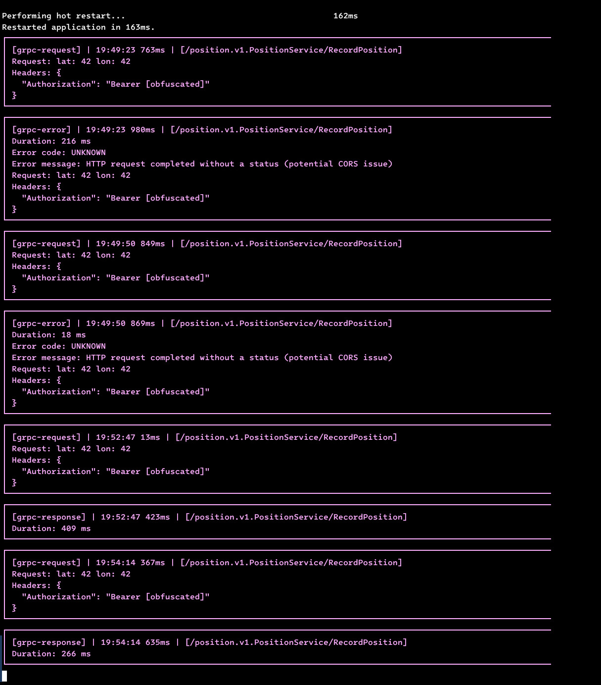

# talker_grpc_logger
Lightweight and customizable [grpc](https://pub.dev/packages/grpc) client logger on [talker](https://pub.dev/packages/talker) base. 
[Talker](https://github.com/Frezyx/talker) - Advanced exception handling and logging for dart/flutter applications 🚀

## Preview
This is how the logs of your grpc requests will look in the console

